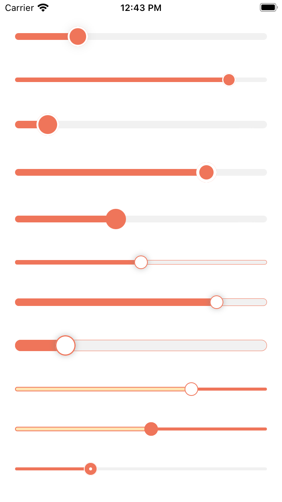
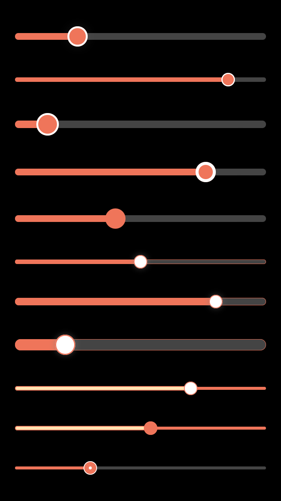

[](https://github.com/ken0x0a/react-native-reanimated-slider/actions)
[](https://www.npmjs.com/package/react-native-re-slider)

---

<p align="center">


</p>

<sup align="center">

Code for this example is [here](#example).

</sup>

---

- [Usage](#usage)
- [Components](#components)
  - [1. `<Slider />`](#1-slider-)
    - [Style presets](#style-presets)
- [Example](#example)
- [Status](#status)

---

## Usage

```sh
yarn add react-native-re-slider
```


## Components

### 1. `<Slider />`

Slider component.

```tsx
import { Slider, genSliderStyle1, genSliderStyle2 } from 'react-native-reanimated-slider'

<Slider {...genSliderStyle1({ thumbSize: 27, thumbBorderWidth: 0 })} />
<Slider {...genSliderStyle2()} />

// NOTE: Slider is just FunctionalComponent, doesn't wrapped by React.memo
const SliderMemo = React.memo(Slider, (prevProps, nextProps) => true)
<SliderMemo {...genSliderStyle2()} />
// ...
```

#### Style presets

- genSliderStyle1
- genSliderStyle2
- genSliderStyle3
- genSliderStyle4

## Example
```tsx
import React from "react";
import { StyleSheet, View } from "react-native";
import { Slider, colors, genSliderStyle1, genSliderStyle2, genSliderStyle3, genSliderStyle4 } from "react-native-re-slider";

export const SliderLightScreen: React.FC = () => {
  return (
    <View style={styles.container}>
      <View style={[styles.slidersBox, { backgroundColor: "white" }]}>
        <Slider step={2} maxValue={10} minValue={2} initialValue={4} />
        <Slider {...genSliderStyle1()} />
        <Slider {...genSliderStyle1({ thumbSize: 30 })} />
        <Slider {...genSliderStyle1({ thumbSize: 27, thumbBorderWidth: 4 })} />
        <Slider {...genSliderStyle1({ thumbSize: 27, thumbBorderWidth: 0 })} />
        <Slider {...genSliderStyle2()} />
        <Slider {...genSliderStyle2({ trackWidth: 10 })} />
        <Slider {...genSliderStyle2({ thumbSize: 27, trackWidth: 15 })} />
        <Slider {...genSliderStyle3()} />
        <Slider {...genSliderStyle3({ color: colors.orange })} />
        <Slider {...genSliderStyle4()} />
      </View>
    </View>
  );
};

const minTrackColor = "#444";

export const SliderDarkScreen: React.FC = () => {
  return (
    <View style={styles.container}>
      <View style={[styles.slidersBox, { backgroundColor: "black" }]}>
        <Slider
          step={2}
          maxValue={10}
          minValue={2}
          initialValue={4}
          minTrackStyle={{ backgroundColor: minTrackColor, borderRadius: 4.5, height: 9 }}
        />
        <Slider {...genSliderStyle1({ minTrackColor })} />
        <Slider {...genSliderStyle1({ minTrackColor, thumbSize: 30 })} />
        <Slider {...genSliderStyle1({ minTrackColor, thumbSize: 27, thumbBorderWidth: 4 })} />
        <Slider {...genSliderStyle1({ minTrackColor, thumbSize: 27, thumbBorderWidth: 0 })} />
        <Slider {...genSliderStyle2({ minTrackColor })} />
        <Slider {...genSliderStyle2({ minTrackColor, trackWidth: 10 })} />
        <Slider {...genSliderStyle2({ minTrackColor, thumbSize: 27, trackWidth: 15 })} />
        <Slider {...genSliderStyle3()} />
        <Slider {...genSliderStyle3({ color: colors.orange })} />
        <Slider {...genSliderStyle4({ minTrackColor })} />
      </View>
    </View>
  );
};

const styles = StyleSheet.create({
  container: { flex: 1 },
  slidersBox: { alignItems: "center", flex: 1, justifyContent: "space-evenly" },
});
```

## Status

If anyone interested in adding new components or features, I appreciate the PR 🙌, But I'm not sure what can be added though.
